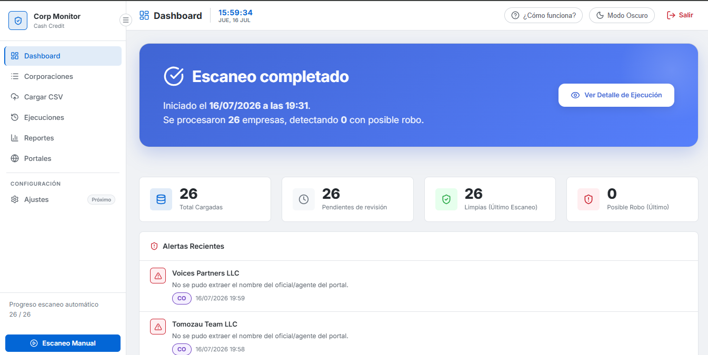

# Corporate Cash Credit Monitor

## 📌 Objetivo del Proyecto
**Corporate Monitor** es una aplicación web diseñada para revisar diariamente registros corporativos en los portales de las Secretarías de Estado de EE. UU. (empezando por Hawaii y Colorado). Su objetivo principal es detectar cambios no autorizados en los registros oficiales, generar evidencia en PDF, registrar resultados y alertar sobre posibles **robos de corporaciones**.

Ante un contexto de urgencia por manipulación activa de entidades, esta herramienta resulta crítica para identificar la alteración de los nombres de los oficiales y detener actividades fraudulentas a tiempo.

## 🚀 Funcionalidades Principales

*   **Escaneo Automatizado:** Revisa el estatus y nombres de oficiales en portales estatales de manera automatizada mediante web scraping (Playwright).
*   **Reglas de Detección:** Un potente motor de normalización de nombres que verifica condiciones críticas de seguridad (ej. existencia obligatoria de ciertos oficiales para marcar una entidad como "Limpia").
*   **Generación de Evidencia:** Realiza capturas de pantalla o documentos en formato PDF de las páginas oficiales del estado cuando se detecta un posible robo.
*   **Gestión de Datos:** Importación de listados diarios mediante archivos CSV.
*   **Reportes y Exportación:** Genera reportes completos en formato Excel listos para ser analizados o compartidos.
*   **Diseño Premium y Moderno:** Interfaz de usuario "Flat Solid Design" con animaciones, gráficos interactivos y soporte para Modo Claro/Oscuro.

## 🛠️ Stack Tecnológico

*   **Backend:** Python con Flask, SQLAlchemy (Base de datos SQLite)
*   **Frontend:** HTML5, CSS3 nativo, JavaScript (Vanilla), Lucide Icons
*   **Scraping y PDF:** Playwright, adaptadores modulares por estado
*   **Procesamiento de Datos:** Pandas, OpenPyXL (Excel)
*   **Estilos y UI:** CSS moderno con variables, Glassmorphism y Flexbox/Grid

## 🇺🇸 Alcance Geográfico (Fases)

**Fase 1 (MVP actual):**
*   Hawaii (HI)
*   Colorado (CO)

**Fases Futuras:**
*   New Mexico (NM), Mississippi (MS), New York (NY), Florida (FL), California (CA), Delaware (DE), Wyoming (WY).

## ⚙️ Flujo General de Trabajo

1.  Cargar archivo CSV con el listado diario de corporaciones a auditar.
2.  El sistema filtra y ordena (ignorando corporaciones "Vendidas" y priorizando las "Disponibles").
3.  Consulta en vivo a las páginas web gubernamentales.
4.  Extracción y normalización de nombres (Agente / Oficiales).
5.  Evaluación basada en reglas criptográficas (Robo Potencial vs Limpio).
6.  Generación automática de capturas y reportes.
7.  Visualización en el Dashboard con gráficos animados e historial completo de ejecuciones.

---
*Desarrollado para la protección y el control auditor de activos corporativos.*
